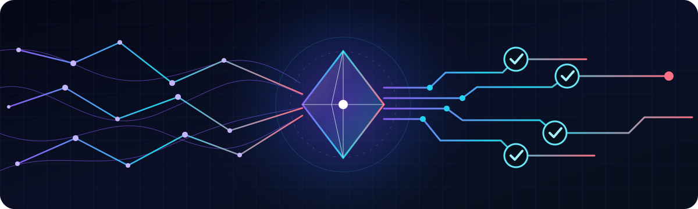

<div align="center">



# Prateek Mishra

### I build intelligent systems — and the automation that keeps them honest.

[](https://portfolio-prateek.vercel.app/)
[](https://www.linkedin.com/in/prateek-mishra-686945243/)
[](mailto:prateekrocks107@gmail.com)

</div>

---

```text
FOCUS     agentic AI platforms · test architecture · developer tooling
CRAFT     full-stack systems that are observable, reliable, and pleasant to use
CURRENT   building PratsPilot and pushing Playwright beyond happy-path testing
```

## Selected work

<table>
<tr>
<td width="50%" valign="top">

### [PratsPilot ↗](https://github.com/Prats222/Agentic_AI_Platform)

A full-stack agentic AI platform with multi-provider LLM support, tool execution, visual workflows, human approval gates, context documents, an agent arena, and runtime cost/latency observability.

`ASP.NET Core` `React` `TypeScript` `SQL` `LLM orchestration`

</td>
<td width="50%" valign="top">

### [Automation Lab ↗](https://github.com/Prats222/playwright-framework-dotnet-react)

A production-shaped React + .NET system backed by **64 Playwright tests** across desktop and mobile: routing, themes, forms, media, APIs, accessibility, CI artifacts, and resilient page objects.

`Playwright` `.NET` `React 19` `TypeScript` `GitHub Actions`

</td>
</tr>
</table>

## The toolkit

<div align="center">


</div>

## Build philosophy

- AI is useful when its behavior is inspectable, measurable, and interruptible.
- Automation should test the product the way a real person experiences it.
- A polished interface and a boringly reliable backend belong in the same repo.

<div align="center">

**Open to building ambitious AI products, automation infrastructure, and developer tools.**

<sub>Code → observe → test → refine → ship.</sub>

</div>
