<p align="center">
  
</p>

<p align="center">
  <a href="https://portfolio-prateek.vercel.app/"><kbd>portfolio</kbd></a>&nbsp;
  <a href="https://www.linkedin.com/in/prateek-mishra-686945243/"><kbd>linkedin</kbd></a>&nbsp;
  <a href="mailto:prateekrocks107@gmail.com"><kbd>email</kbd></a>
</p>

## `./active_processes`

### `PID 01` · [PratsPilot](https://github.com/Prats222/Agentic_AI_Platform) · `RUNNING`

An agentic playground where models get tools, memory, context, visual workflows, human approval gates, and enough telemetry to explain what they just did.

`ASP.NET Core` `React` `TypeScript` `multi-provider LLMs`

### `PID 02` · [Playwright Automation Lab](https://github.com/Prats222/playwright-framework-dotnet-react) · `64/64`

A React + .NET system built to be poked, prodded, resized, deep-linked, and broken by **64 desktop + mobile Playwright tests**.

`Playwright` `.NET` `React` `GitHub Actions`

## `./quest_log`

- [x] Make agents use real tools
- [x] Pause a workflow and ask a human
- [x] Make browser tests survive the weird stuff
- [x] Ship something bigger than a tutorial
- [ ] Build the next thing worth obsessing over

<details>
<summary><code>cat stack.txt</code></summary>
<br>

```text
backend    C# · ASP.NET Core · SQL
frontend   React · TypeScript · Vite
quality    Playwright · Pytest · GitHub Actions
shipping   Docker · Vercel · Render
```

</details>

<br>

```console
prateek@github:~$ echo $PHILOSOPHY
make it useful. make it reliable. make it feel good.
```
